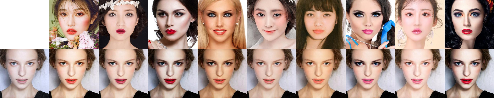

# 유튜브 빵형의 개발도상국 참고
# BeautyGAN
# 연예인 메이크업 따라하는 서비스

See [test.ipynb](test.ipynb), includes:
- Face detection from random images
- Facial landmarks detection
- Face alignment
- Inference


### Introduction

BeautyGAN: Instance-level Facial Makeup Transfer with Deep Generative Adversarial Network

Website: [http://liusi-group.com/projects/BeautyGAN](http://liusi-group.com/projects/BeautyGAN)

Essays and datasets are provided, but no open source code and no trained models are provided.

### Result



### Usage

- Python3.6
- TensorFlow 1.9

Download pretrained model

- [https://pan.baidu.com/s/1wngvgT0qzcKJ5LfLMO7m8A](https://pan.baidu.com/s/1wngvgT0qzcKJ5LfLMO7m8A)，7lip
- [https://drive.google.com/drive/folders/1pgVqnF2-rnOxcUQ3SO4JwHUFTdiSe5t9](https://drive.google.com/drive/folders/1pgVqnF2-rnOxcUQ3SO4JwHUFTdiSe5t9)

Save pretrained model to `models`

`imgs` contains 11 non-makeup, 9 makeup images

`imgs/no_makeup/xfsy_0068.png` default non-makeup source image

```
python main.py
```

If you need to put makeup on someone else's face image, pass through the image path. Use a proper size face images.

```
python main.py --no_makeup xxx.xxx
```

# beauty gan을 통하여 연예인 화장법을 내 민낯에 그대로 연출할 수 있다
# 단순히 이목구비의 화장을 그대로 얹는 것이 아니라 모양에 맞게 자연스러운 화장이 연출되고 피부 톤까지 잘 맞음
